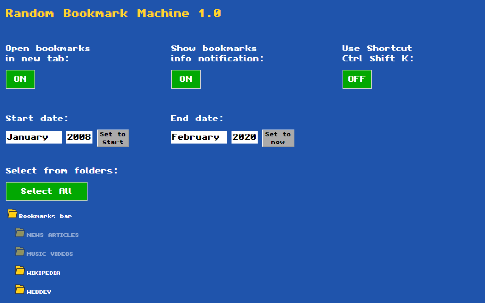
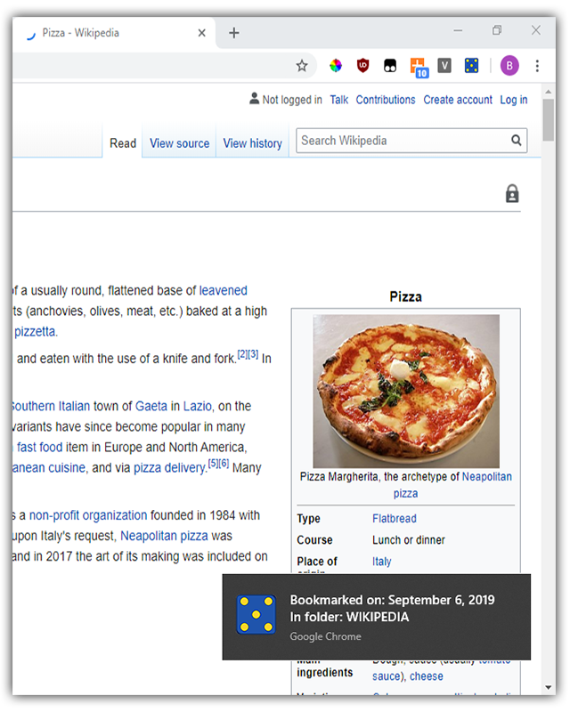

# Random Bookmark Machine

This Chrome extension adds a button to your Toolbar that, every time is clicked, opens **a random website** from your bookmarks list.

 

  

 

The extension's behavior is heavily customizable in the **vintage styled** Options page:

 

  

 

You can choose to:
- Select only bookmarks stored in some **specific folders**
- Select only bookmarks created in a specific **range of dates**
- Open each bookmark in a **new tab** or always in the same tab
- Show a short **notification** for every bookmark opened. In the notification you will see the date of when you bookmarked the website and the name of the folder where the bookmark is stored
- Use the **keyboard shortcut** Ctrl + Shift + K to open the bookmarks, instead of the Toolbar button

 

  

 
 

&nbsp;  

## Stack used:

HTML, CSS, Javascript (Extensions APIs)

&nbsp;
  
### Chrome Web Store link: 

https://chrome.google.com/webstore/detail/random-bookmark-machine/jpofhhlmbncfdodogngdidhkecjigaab