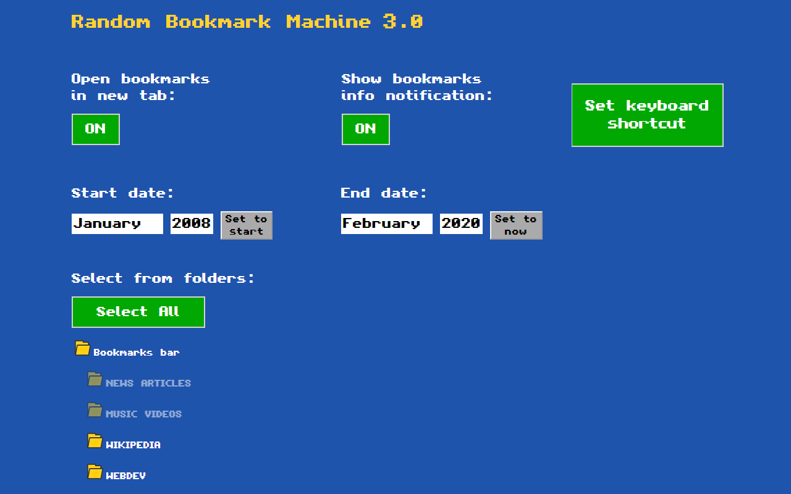

# Random Bookmark Machine

This Chrome extension opens **a random URL** from your bookmarks list every time the extension button is clicked.

 

  

 

The extension's behavior is heavily customizable in the **vintage-styled** Options page:

 

  

 

You can choose to:
- Select only bookmarks stored in some **specific folders**
- Select only bookmarks created in a specific **range of dates**
- Open each bookmark in a **new tab** or always in the same tab
- Show a short **notification** for every bookmark opened. In the notification you will see the date of when you bookmarked the website and the name of the folder where the bookmark is stored
- Set a custom **keyboard shortcut** to activate the extension instead of using the toolbar button

 

  

 
 

&nbsp;  

### Stack used:

HTML, CSS, Javascript (Extensions APIs)

&nbsp;
  
### Install here: 

